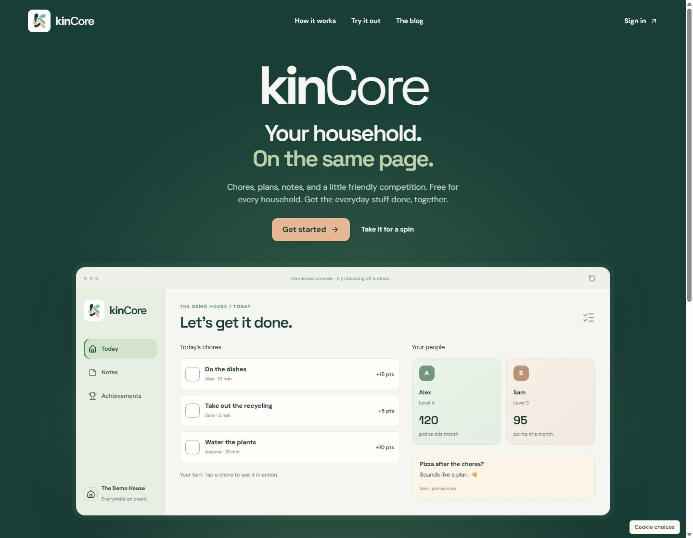
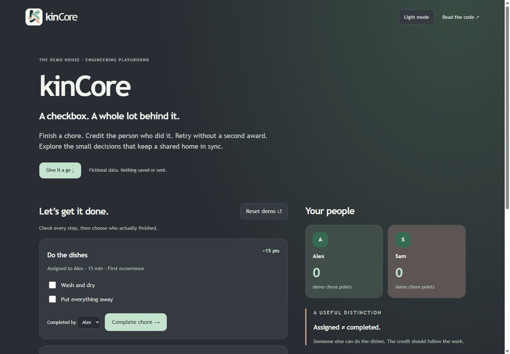

<p align="center"></p>

# kinCore

### Your household. On the same page.

Chores, shared calendars, notes, and a little friendly competition. A household app built for phones, tablets, and paired kitchen screens. **Core features are free for every household.** Optional support funds the mission and adds cosmetics, never a gameplay advantage.

[Try kinCore](https://kincore.co/welcome) · [Explore the architecture](docs/architecture.md) · [Run the engineering demo](#run-the-showcase) · [Read the product scope](docs/product.md)



## The interesting part is what happens after the checkbox

Completing a chore touches scheduling, attribution, points, achievements, history, and sometimes an unreliable connection. Those changes need to agree. kinCore treats a completion as a transaction, keeps recorded outcomes stable, and prevents repeated requests from awarding repeated credit.

| Product problem | Engineering response |
| --- | --- |
| Yesterday's dishes are still unfinished | Keep one open occurrence of a recurring chore; avoid a growing duplicate backlog. |
| Someone finishes another person's assigned chore | Credit the actual completer. Assignment and attribution are separate. |
| A screen loses Wi-Fi mid-completion | Queue completions locally and replay with idempotency safeguards. |
| A routine changes after it was completed | Snapshot checklist and scoring inputs so history keeps its meaning. |
| Friends want a competition, not access to your home | Share opt-in aliases and aggregate results, not chore titles or calendar contents. |
| A calendar becomes another place to maintain | Combine scheduled kinCore chores with selected read-only Google events. |

## What ships

- **Shared work:** 100 ready-made chore presets, custom tasks, assignments, recurrence, overdue indicators, groups, and ordered checklists.
- **Progress:** points, levels, streaks, hundreds of achievements, hidden discoveries, and profile insights across days, categories, and periods.
- **A shared home:** notes, a combined calendar, multiple households and invitations, onboarding, and revocable Fridge Mode pairing.
- **Friendly competition:** opt-in household friendships and privacy-limited comparisons.
- **A sustainable free product:** optional Supporter and Legend cosmetics, with formatted PDF keepsakes for Legend. Core features and existing data exports stay free.

Google Calendar's public OAuth verification is still a launch dependency. Physical refrigerator compatibility depends on the browser and device; universal support is not claimed. See [scope and limitations](docs/product.md).

## Built with

**Next.js App Router · React · TypeScript · PostgreSQL · Supabase · Tailwind CSS**

Server-side Google Calendar integration, Stripe hosted checkout, IndexedDB for queued completions, RRULE scheduling, and timezone-aware aggregation. Hosted on Vercel; transactional data and authentication use Supabase.

Read the [architecture](docs/architecture.md), [design decisions](docs/decisions.md), [delivery and testing practices](docs/engineering.md), and [security boundaries](SECURITY.md).

## Run the showcase

Requires Node.js 22 or later. **No accounts, credentials, dependency installation, or production connection.**

```sh
git clone https://github.com/wo0zle/kincore-showcase.git
cd kincore-showcase
npm test
npm start
```

Open **http://127.0.0.1:4173**. Complete checklist steps, award a chore, simulate a retry, and inspect the next occurrence and ledger. Reset returns to fictional sample data. Light and Graphite modes are included.

The browser demo and tests share a small illustrative model. It demonstrates invariants; it is **not the production application, its database implementation, or a security reference**. Demo points are intentionally simplified. [Demo notes](demo/README.md) explain the boundary.



## Repository map

```text
assets/               Brand mark and public-preview screenshot
docs/                 Architecture, scope, decisions, delivery evidence
demo/                 Independent browser demo and illustrative domain model
scripts/              Local-only server and public-content checks
.github/workflows/    CI for the showcase examples and publication boundary
SECURITY.md           Reporting and public/private boundaries
```

## Open for inspection, with a clear boundary

This is a curated public engineering showcase. The production repository, customer records, credentials, operational configuration, database migrations, and private editorial work are excluded. Publishing this repository does not deploy or change kinCore.

Product/design feedback belongs in [kinCore feedback](https://kincore.co/feedback). Please report suspected security issues privately using the instructions in [SECURITY.md](SECURITY.md).

Built by **kin**. [kincore.co](https://kincore.co) · [The blog](https://kincore.co/blog)

Documentation snapshot: October 8, 2026. See [NOTICE](NOTICE) for use of these materials.
