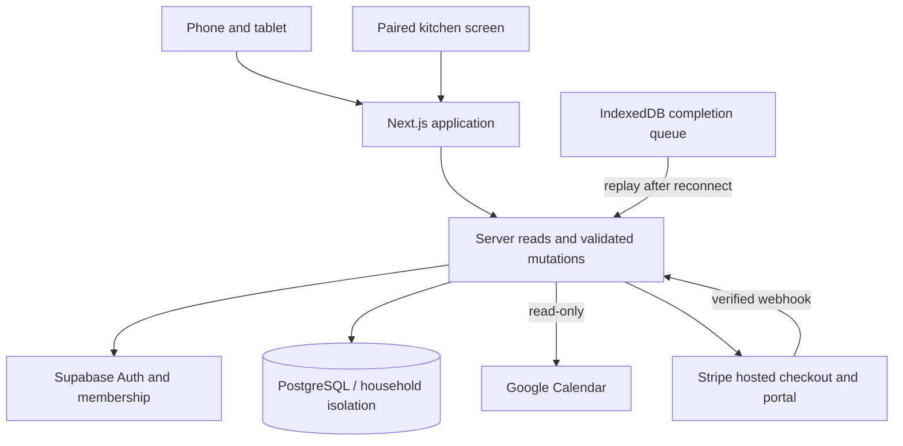
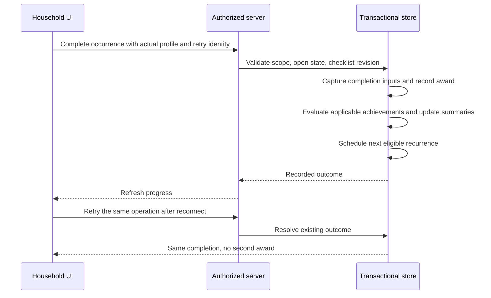

# Architecture: shared state, clear ownership

kinCore has two identity layers. An authenticated account can belong to households and administer them according to its role. A household profile represents the person receiving an assignment, completing a chore, and earning progress. A paired kitchen screen is a revocable device, not another administrator.

## A completion is a state transition

This illustrates logical responsibilities, not the production SQL or an exact endpoint contract. Duplicate requests and overlapping work must converge on a single recorded outcome.

## Template, occurrence, completion

A template describes future work. An occurrence is the specific scheduled job currently open. A completion captures what happened: the actual completer, time, checklist, scoring inputs, and resulting award. Editing future work must not rewrite completed history.

Recurring work has one open occurrence per template. Overdue work remains visible; a new open copy does not stack on top of it. Once resolved, recurrence calculation determines the next eligible date. The rules use household-local dates rather than assuming every household lives in the server's timezone.

## Calendar and friends are different boundaries

Google Calendar remains the editor for imported events. kinCore displays selected events alongside its own scheduled chores. Tokens and exchanges stay server-side. Public Google OAuth verification is still pending at this snapshot.

Friendship is bilateral and opt-in. A friend's view receives a limited comparison projection. It does not reuse the household's full task/calendar payload. Secret achievements remain concealed until earned.

## Offline has a defined scope

The browser queues chore completions for replay after reconnect. This is not a claim that every operation works offline. Checklist partial progress saves online; offline step state accompanies a queued completion. A changed checklist revision must not silently complete a newer version.

## Refresh and deployment

Visible-page periodic refresh and reconnect refresh are implemented. General realtime subscriptions are future work. Vercel hosts the Next.js application; Supabase provides authentication and transactional data. A fully independent self-hosted authentication/API stack is not presented as finished.
